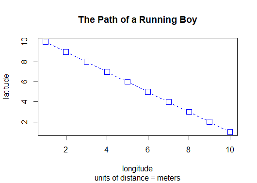
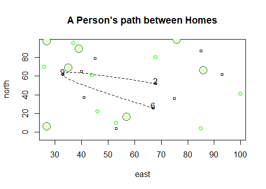
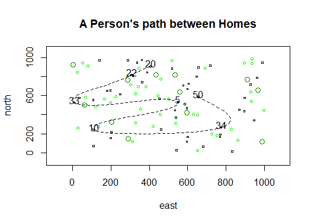

# Getting started with R

[View code](https://github.com/micrittenden/Data440-AgentBasedModelling/blob/master/HW/1.2_Getting_started_w_R/getting_started_w_R.R)

### Part One: Creating a Plot

Here is a line plot customized with blue color, dashed line style, and square points.

### Part Two: Creating a More Complicated Plot

Here is a more complicated plot which was created using a dataframe. The 10 small black squares are dwellings and the 20 green circles are small/large trees. A curved, dashed line represents a person's path as they walk between three dwellings.

### Part Three: Created the Challenge Plot

Here is a plot similar to the one above, but with increased dwellings (50), small trees (40), and large trees (12). The person now also travels between 7 dwellings.

[View code](https://github.com/micrittenden/Data440-AgentBasedModelling/blob/master/HW/1.2_Getting_started_w_R/getting_started_w_R.R)
