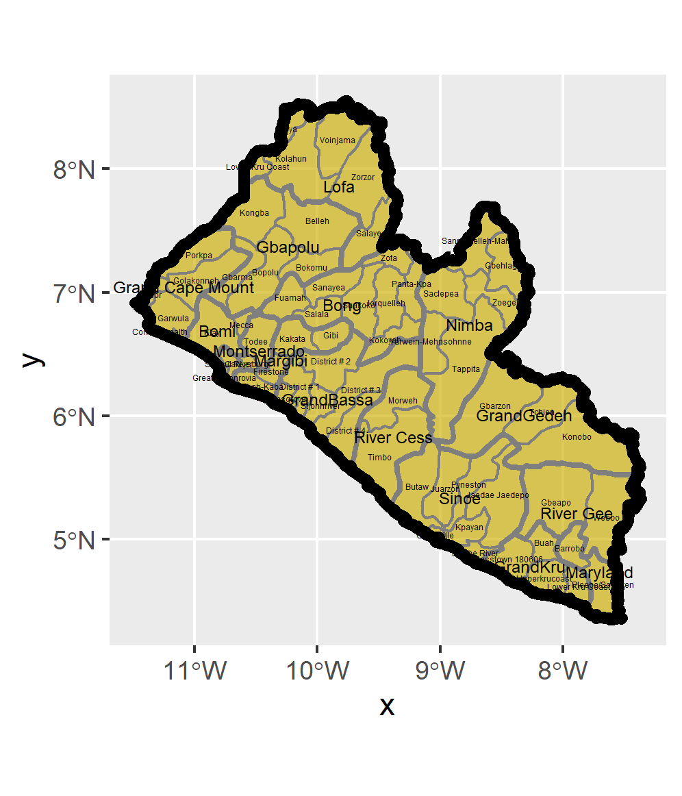
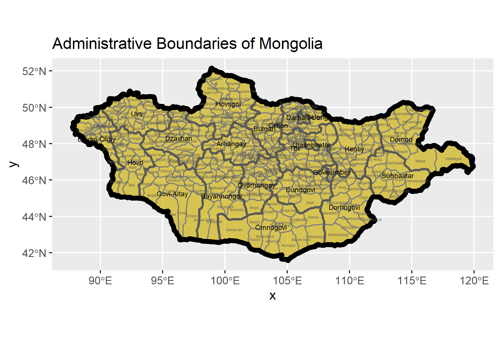
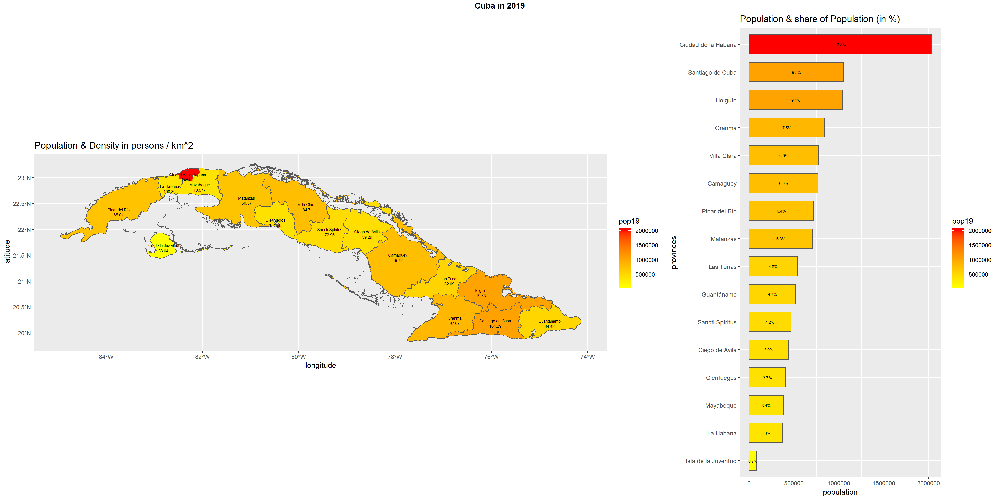

# Spatial Population Statistics

### Part One: Liberia

First, I created a map of Liberia's administrative boundaries (from GADM) using a golden fill and various greyscale borders. Labels are different sizes to help differentiate levels.

### Part Two: Mongolia

Second, I replicated my process above with Mongolia.

### Part Three: Cuba

However, when introducing a population data raster, it was no longer feasible to use Mongolia as my case country; its land mass is too massive for my laptop to compute hundreds of millions of points. So, I switched to Cuba, which has a much more accomplishable number of points (about 14 million).

This side-by-side map and bar plot duo display the population and population density of Cuba at the provincial level. The highest population density is in the capital city, Habana. These plots use a yellow to red gradient fill to help differentiate populations. These plots rely on packages including Tidyverse, sf, raster, and ggpubr.

