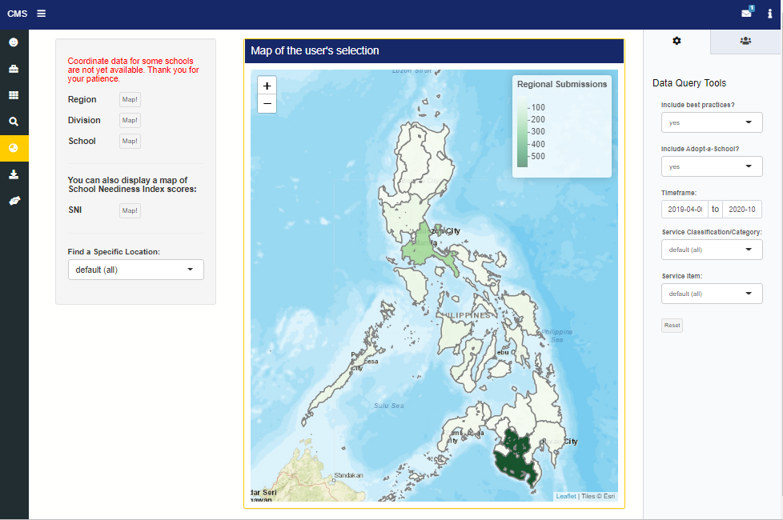

# Data Science Insight 3

### Observational Bias and Poverty Cycles in Data-Driven Development Interventions

Note that all opinions are my own and not that of any organizations to which I belong. Any expressed criticisms are on the smallest of details and do not reflect the larger goals and successes of the related initiatives.

#### Background information:

In Summer 2019, I worked as a Freeman Fellow in Metro Manila, Philippines for ten weeks. I was the data scientist for CheckMySchool (CMS), a local initiative to improve public education and student safety in the Philippines, at the Affiliated Network for Social Accountability - East Asia and the Pacific (ANSA-EAP). My task was to develop a dashboard which would host, process, and visualize data on school resource needs reported through the new CMS mobile app, which allows anyone engaged in the Philippines public education system (whether as a student, parent, teacher, or official) to report what resources are needed at their local school. The prototype for this dashboard can be seen [here](https://www.checkmyschool.org/cms-app-reports/) on the CMS website. There are several limitations to the R Shiny dashboard, with the most impactful ones being the lack of a more efficient central, live database (this runs through the Google Drive API) and long loading times (the dashboard uses the free R Shiny server). These issues were meant to be improved in Summer 2020 by the next cohort of Freeman Fellows, but the global COVID-19 pandemic eliminated that opportunity. However, the greatest challenge to CMS is not how we handle or visualize the data, but rather how the data is collected. Our data collection relies on crowdsourcing via a mobile phone app. There is an option to submit reports through the CMS website or to send paper submissions, but the primary (and easiest) way to submit is through the mobile app. But the digital divide, especially smartphone ownership rates, remains stark in the Philippines. In [2019](https://www.statista.com/statistics/625427/smartphone-user-penetration-in-philippines/), only 57.6% of the population used a smartphone. Where smartphones are used, it's not uncommon to experience slow loading times [(source)](https://www.worldbank.org/en/news/press-release/2020/10/05/harnessing-digital-technologies-can-help-philippines-overcome-impact-of-pandemic-hasten-recovery). So, the individuals most able to report their school needs are those with access to smartphones and fast internet. These individuals will more often be from higher socioeconomic backgrounds and likely attend schools which are not the worst off. This introduces the potential for bias in our data collection which can have immediate effects by influencing Department of Education decisions in allocating resources and long-run effects by impacting data-driven attempts to project future school resource needs. Data collection along socioeconomic lines can unintentionally uphold a poverty cycle where those who are better able to report get increased resources, while those who are already worse off receive less. Clearly, this is a problem if our mission is to equitably promote student achievement and safety in schools. *Our data collection is also influenced by where our volunteer network is actively advertising the app, though this bias would be reduced if the national government sponsored the app. Below, you can see a map of our submissions by region. The most submissions are from the National Capital Region (near the center) and Region XII, where our networks are most active and mobile phone access may be higher. CMS is an amazing idea which has been funded by the Bill & Melinda Gates Foundation and other presitigous funds, but it has its share of limitations given the Philippines' current digital divide in mobile phone ownership and internet access. It speaks to the broader global social problem of access to digital technology.
 

#### The Data Component & Takeaways:

We've discussed how development interventions which rely on mobile phones can be limited (and reinforce) the digital divide, but what does that mean for our data-driven analyses? Our observational data is most affected by [availability bias](https://www.foreseemed.com/blog/bias-in-machine-learning), or when the data is based on what the modeler’s most aware of. In our case, populations with access to smartphones and CMS volunteers. If this dataset is applied elsewhere in the Philippines, the generated model may recommend incorrect procedures or ignore possible outcomes because of the limited availability of the original data source. This bias would be especially detrimental when trying to forecast future school resource needs. In fact, I was invited to a session on applying predictive analytics for future school construction with the PH Department of Education's School Effectiveness Division during my stay. The discussion was on where to place future schools based on growing population demands and the availability of funds. If CMS' school resource needs data was also included in this analysis, it would skew results toward the school districts in the National Capital Region and Region XII, where the most reports are coming from, but also where the most need likely is not. Quoting a [Cornell study](https://news.cornell.edu/stories/2019/02/social-scientists-take-data-driven-discrimination) on data-driven discrimination, “If we’re building a machine-learning model and we calibrate it on historical data, we’re just going to propagate the inherent biases in the data.” Put more simply, and perhaps ominously, “Algorithmic decision-making is the civil rights issue of the 21st century.” It is our responsibility as (social) data scientists to ensure that the work we do is ethical and effective beyond just having good intentions. We must be vigilant in criticizing our own methods and models and recognizing their limitations.