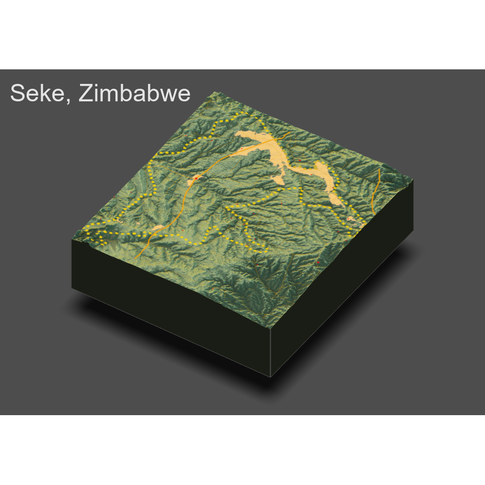

# Project 1

### Part One: Case Selection

### Part Two: Plotting Population Density Across Mashonaland East

### Part Three: Honing in on Seke and Mapping De Facto Settlements and Defining Characteristics

