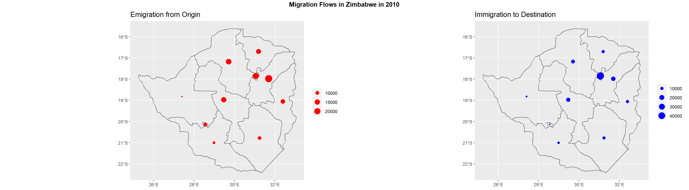
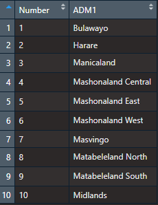
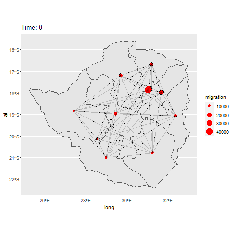
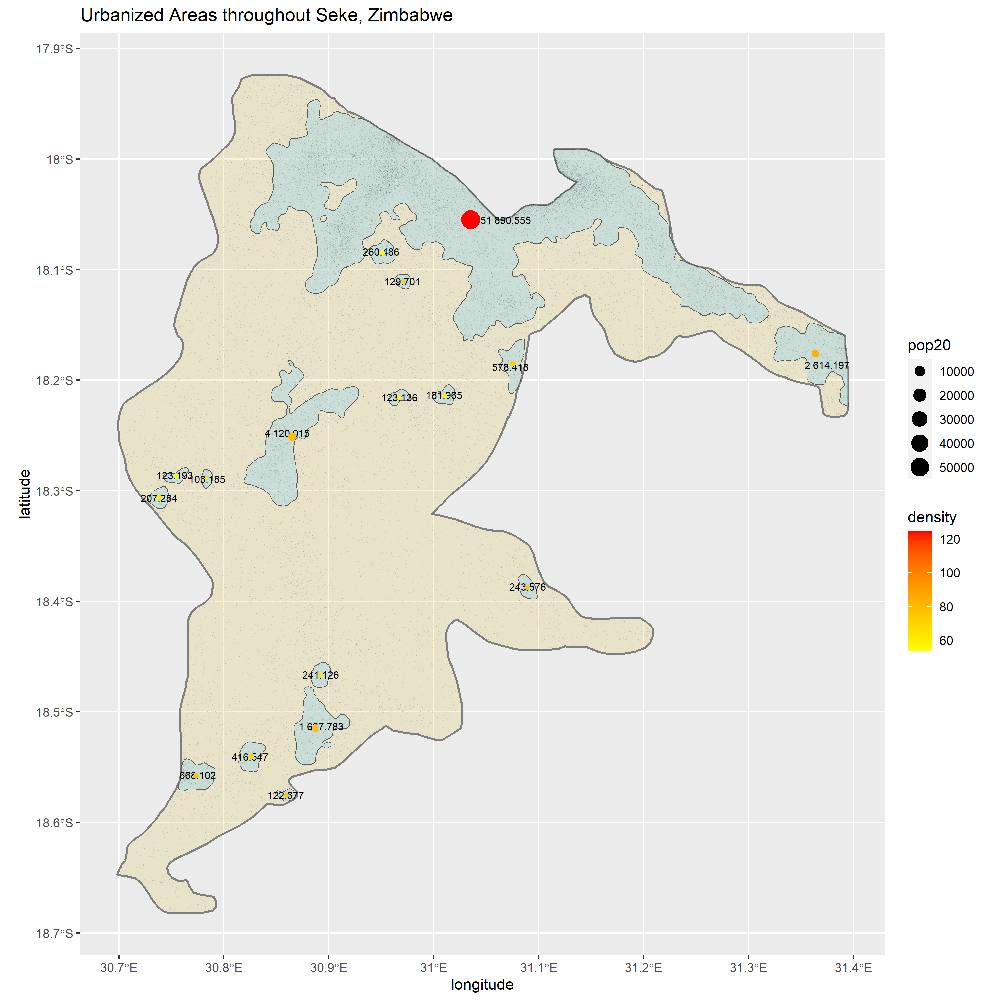
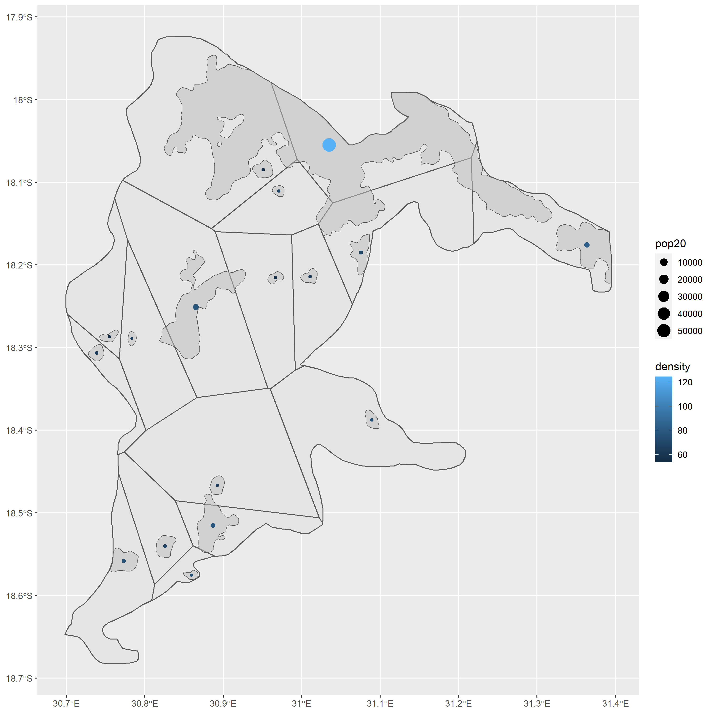

# Project 3

The goal of this project is to begin modelling human migration for Zimbabwe and the district of Seke.

### Description of Survey Data: Provide a written description of your selected household survey including the number of household and person observations as well as the variables in your source data.

I downloaded individual and household data from Zimbabwe Standard DHS 2015. The data can be requested for download [here](https://dhsprogram.com/data/dataset/Zimbabwe_Standard-DHS_2015.cfm?flag=1). The final report for the survey can be viewed [here](https://dhsprogram.com/pubs/pdf/FR322/FR322.pdf). You may need to be a registered user with approved access to view the data. I ended up only using the household data in my analysis, as I could expand it to individual-level data by rearranging how it recorded household members from columns to rows. I first explored the data in Stata to identify the variables which I would use in the study. The variables of interest are household ID (hhid), unit area (hv004), weights (hv005), location (hv024), household size (hv009), sex of household members (hv104_01 through hv104_27), age of household members (hv105_01 through hv105_27), education of household members (hv106_01 through hv106_27), and wealth (hv270) (though, wealth was not included in the formal analysis). I focused my analysis on the region of Mashonaland East, the ADM1 directly east of the capital, Harare. I also used population data from World Pop for Zimbabwe 2015, 100m resolution. The data can be downloaded [here](https://www.worldpop.org/geodata/summary?id=5209). The methods used in this paper are inspired by Frazier and Alfons ([2012](https://papers.ssrn.com/sol3/papers.cfm?abstract_id=2086345)). In the study of Mashonaland East, we end up with 373,402 households and 1,550,482 persons. These numbers are consistent with present population statistics and the average household size in the region (about 4 persons). A preview of the raw household data for Mashonaland East can be seen below.

Figure 1:

Figure 2:

Figure 3:

Figure 4:

Figure 5:

