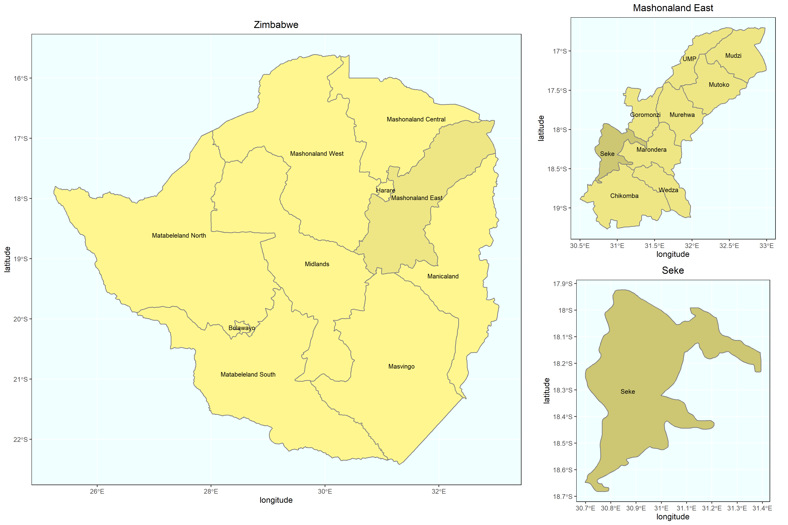
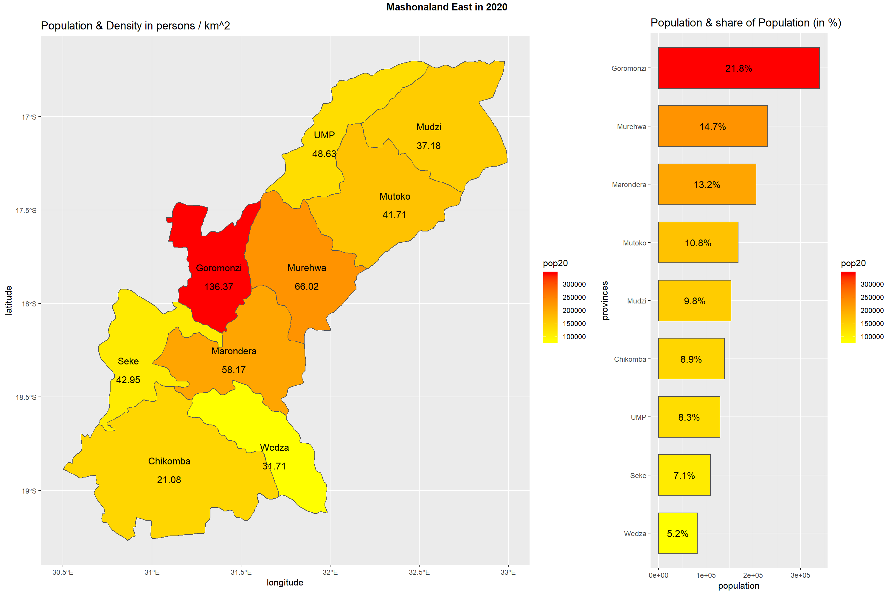
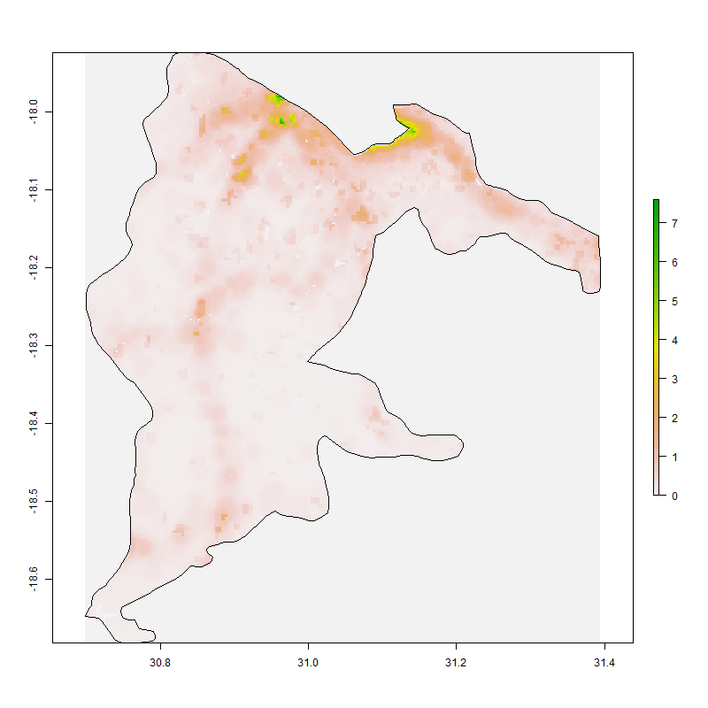
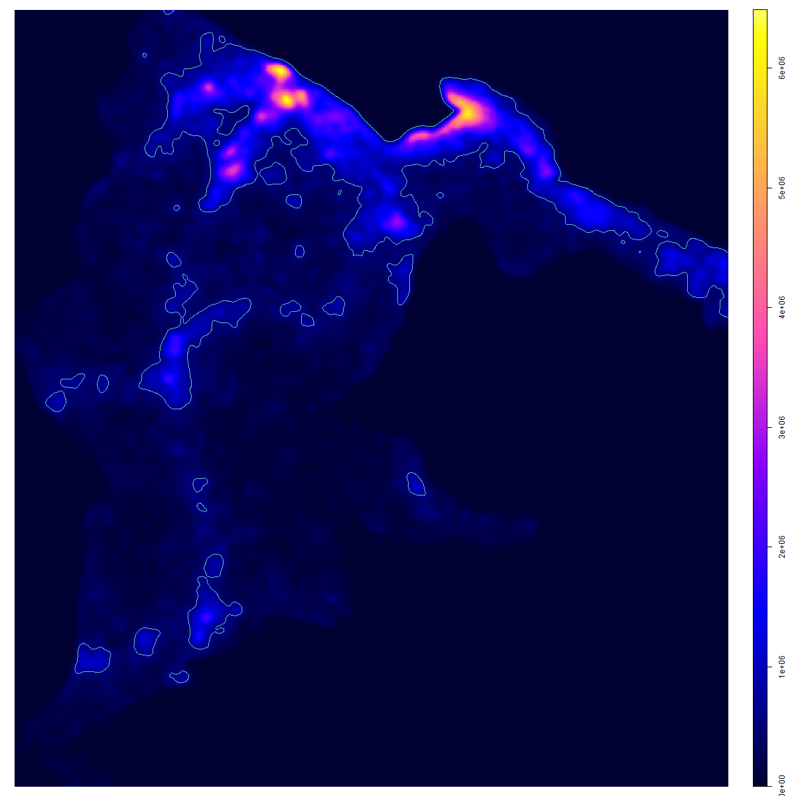
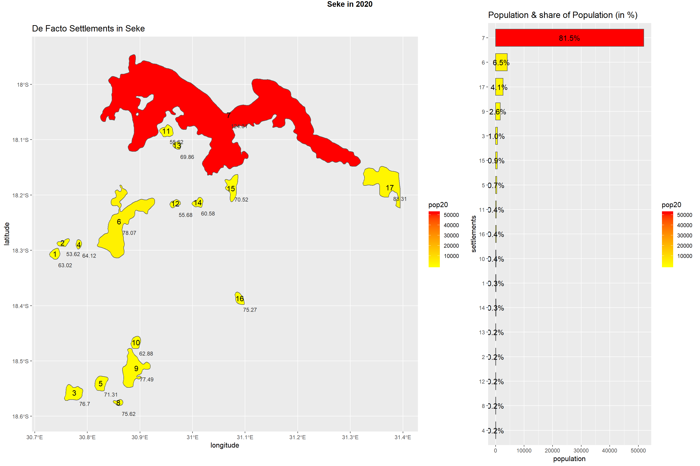
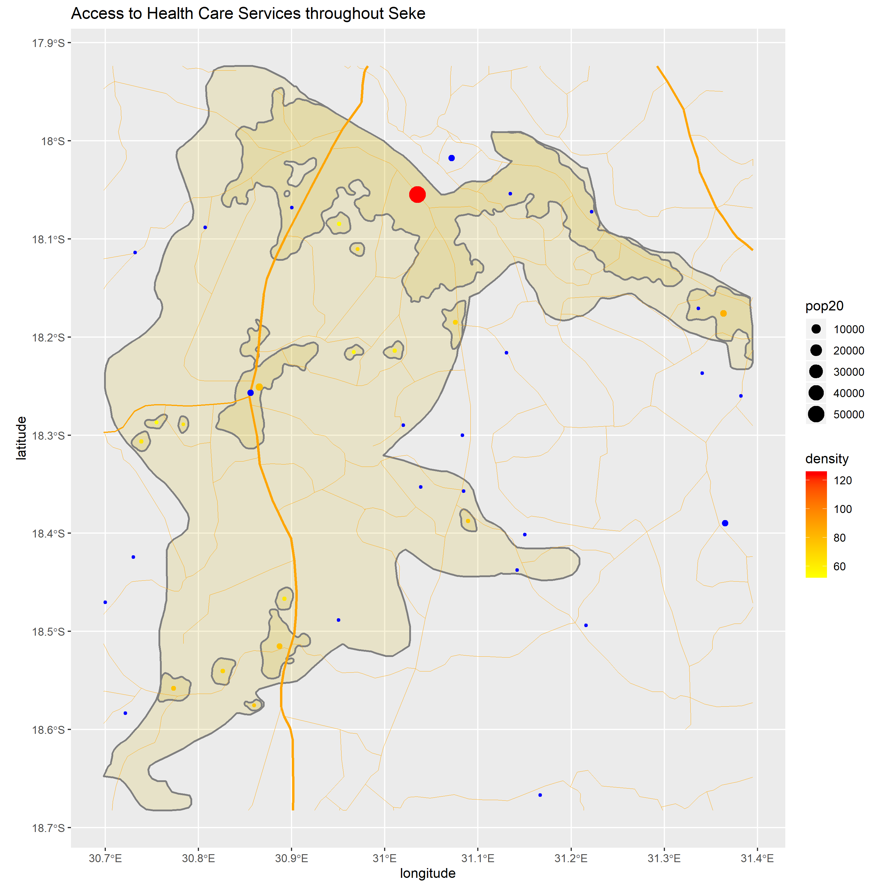
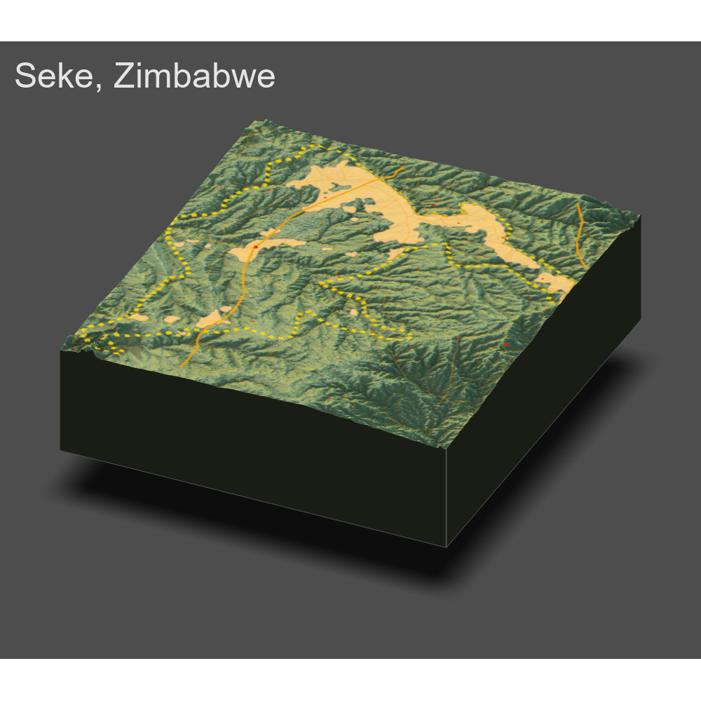

# Project 1

### Part One: Case Selection

I was inspired to study Zimbabwe after reading a few works on the country's 2008/09 Cholera crisis (Chigudu 2016; Chigudu 2019). The crisis was the result of historically poor management of the country's sewage and water treatment infrastructure, exacerbated by President Mugabe and the ZANU(PF) in office. The damage it caused coupled with poor (if not counterproductive) response from the government decreased trust in and reliance on the government among local township residents, effectively hardening a self-resilience mindset.

Simultaneouly, the crisis had significant international ramifications. Many Western countries responded quickly, but through a perspective of securitization (the cholera outbreak was a hazard to other countries, therefore must be stopped) and human rights (the Mugabe regime was corrupt and exhibited poor quality of governance which resulted in the life-threatening cholera crisis). Conversely, the Mugabe regime accussed the West of encroaching on Zimbabwean sovereignty and spread false narratives -- on public health and politics -- to stay in power.

These incredibly complex dynamics seemed like a great segue into studying the complex systems and the roles of individuals in agent-based modeling. However, the capital, Harare, has too high a population to work with in an intro-level model and on an 8GB RAM computer. Looking to nearby para-urban administrative zones adjacent to Harare, the western districts of Mashonaland East province stuck out as having manageable population sizes. Among these, Seke has a population (110,037 in 2020) in our class's prescribed "Goldilock's Zone" of about 100,000. Further, it is directly south of the sections of Harare which experienced the worst outbreaks and is connected to these areas by the A4 Highway, part of the North-South part of the Trans-African Highway which connects Cairo to Cape Town. This road, among other primary roads in the district is shown later in Figure 6.

Figure 1:

### Part Two: Plotting Population Density Across Mashonaland East

To further quality assure Seke as a suitable location to study, I studied the population densities of each district in Mashonaland East (see Figure 2). First, I ruled out the districts with the highest populations (Goromonzi, Murehwa, Marondera) and those which were too far away from Harare (Mudzi, Mutoko, UMP). Of the remaining three, Seke had the median population size, but the highest density. It was a simple and somewhat unscientific method of case selection, though, the distribution of people across the space attracted me it (see Figure 3).

Figure 2:

Figure 3:

### Part Three: Honing in on Seke and Mapping De Facto Settlements and Defining Characteristics

Then, I set out to map the settlements, or the de facto areas of high population density, across Seke. I edited the population raster to replace all NAs with 0 to avoid issues when drawing contour lines around the densest areas; for example, an issue I had run into was a blob of NA values (presumably a lake) which intercepted the boundary of a settlement, preventing its transformation to a polygon. I generated a probabilistic spatial point pattern and used the bw.ppl function to select a smoothing bandwidth for encircling the de facto settlements. Originally, I drew the contour lines at 1,000,000 levels, but this created less than 10 settlements across Seke after accounting for noise (removing those with under 100 residents). Observing the original population raster suggested that more settlements should have been identified, so I lowered the levels argument to 600,000. This drew 17 settlements after again accounting for noise. As is visible in Figure 5, one of the settlements (arbitrarily labeled #7) accounts for 81.5% of residents within all settlements. Another 14.2% is made up by the next four largest settlements. The remainder each make up less than 1% of the people in the system.

Figure 4:

Figure 5:

I added vector data for primary, secondary, and non-classified roads which cross through Seke. These roads are differentiated by width to indicate status (primary being the largest) and connect almost all the settlements to one another. Some settlements are not directly connected by the roads presented in Figure 6, but are very likely connected by minor streets. Overall, these roads appear capable of facilitating access to the identified settlements across Seke. I also added blue points for hospitals and clinics, with the former being larger. The warm-toned points again indicate the relative sizes and densities of the settlements. Lastly, I plot the same map using elevation data to indicate the proximate topography of Seke.

Figure 6:

Figure 7:

