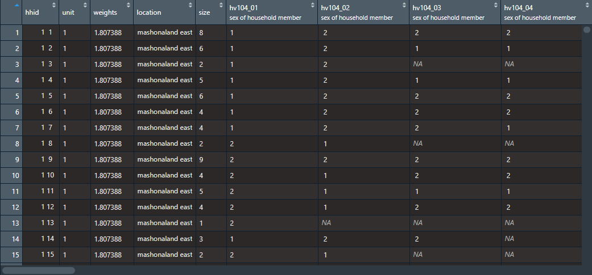
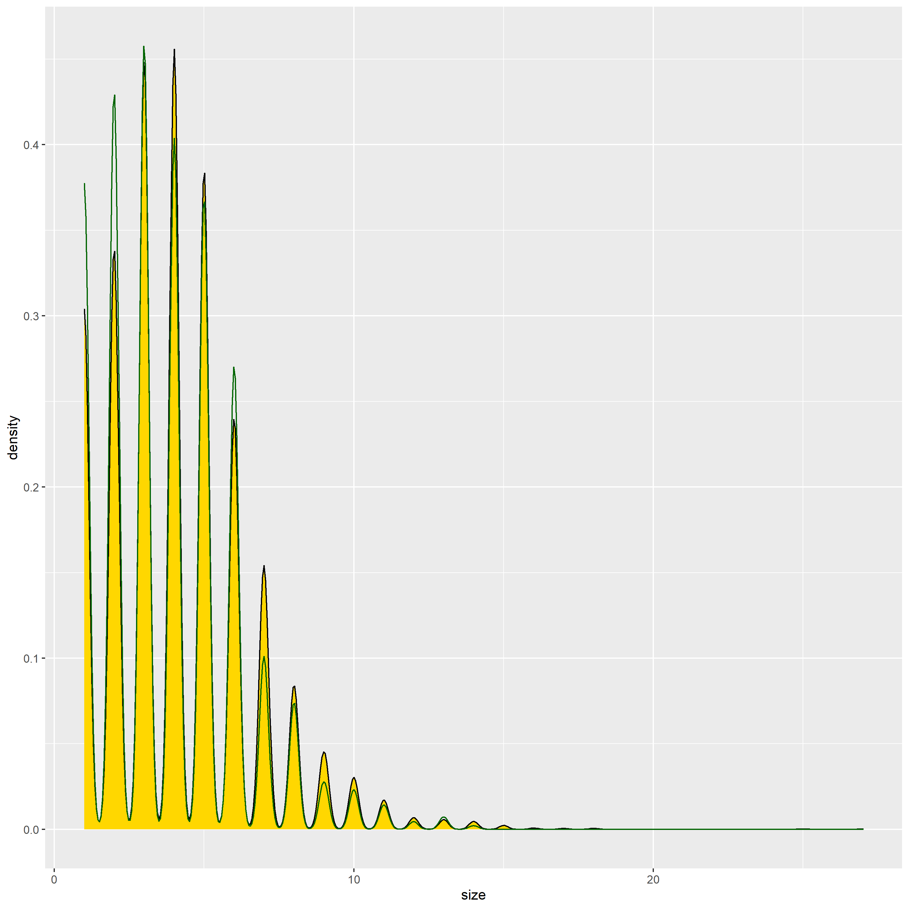
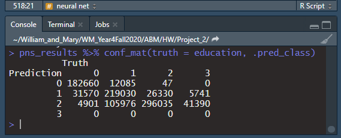
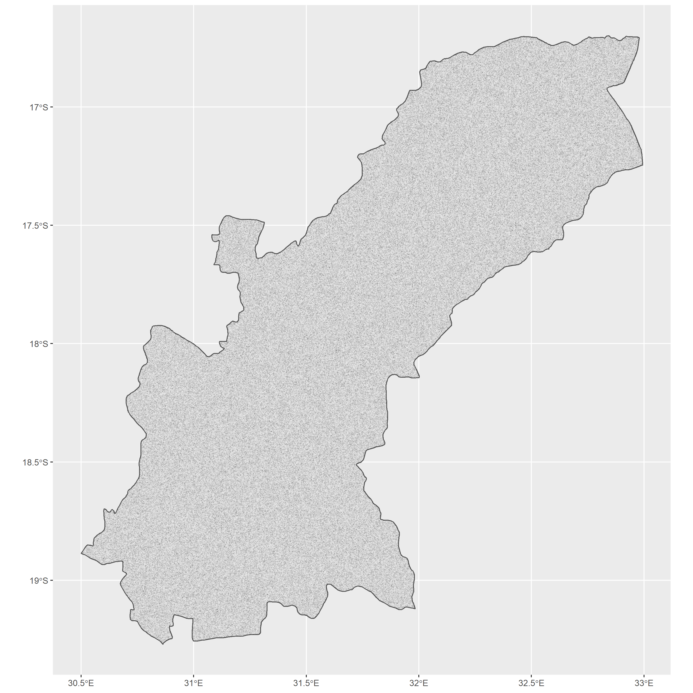
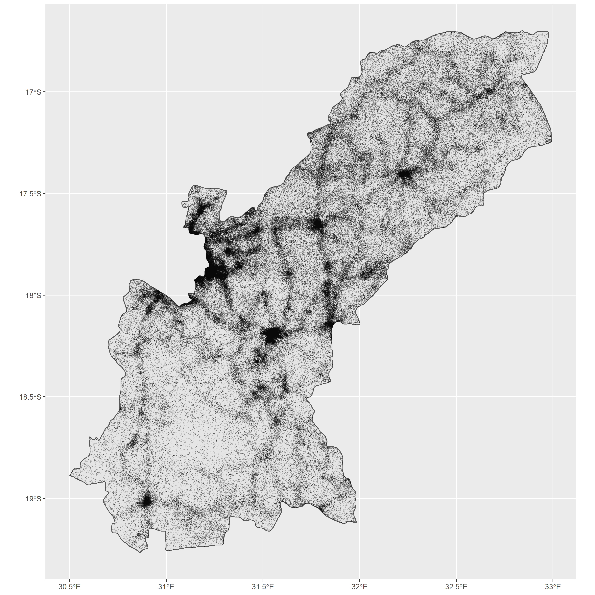

# Project 2

The goal of this project is to generate synthetic population data for East Mashonaland, Zimbabwe. The results of this project will be used with those of Project 1 to begin modeling agents' movement through the region using a gravity model in Project 3.

### Description of Survey Data: Provide a written description of your selected household survey including the number of household and person observations as well as the variables in your source data.

I downloaded individual and household data from Zimbabwe Standard DHS 2015. The data can be requested for download [here](https://dhsprogram.com/data/dataset/Zimbabwe_Standard-DHS_2015.cfm?flag=1). The final report for the survey can be viewed [here](https://dhsprogram.com/pubs/pdf/FR322/FR322.pdf). You may need to be a registered user with approved access to view the data. I ended up only using the household data in my analysis, as I could expand it to individual-level data by rearranging how it recorded household members from columns to rows. I first explored the data in Stata to identify the variables which I would use in the study. The variables of interest are household ID (hhid), unit area (hv004), weights (hv005), location (hv024), household size (hv009), sex of household members (hv104_01 through hv104_27), age of household members (hv105_01 through hv105_27), education of household members (hv106_01 through hv106_27), and wealth (hv270) (though, wealth was not included in the formal analysis). I focused my analysis on the region of Mashonaland East, the ADM1 directly east of the capital, Harare. I also used population data from World Pop for Zimbabwe 2015, 100m resolution. The data can be downloaded [here](https://www.worldpop.org/geodata/summary?id=5209). The methods used in this paper are inspired by Frazier and Alfons ([2012](https://papers.ssrn.com/sol3/papers.cfm?abstract_id=2086345)). In the study of Mashonaland East, we end up with 373,402 households and 1,550,482 persons. These numbers are consistent with present population statistics and the average household size in the region (about 4 persons). A preview of the raw household data for Mashonaland East can be seen below.

Figure 1:

### (2) Provide a written description of your spatially located households at the adm0 level of your selected location, including how you located each household, generated the household structure including demographic attributes of persons, and the percent error calculated. If you faced computational issues at the adm0 level when attempting to pivot from households to persons, describe those limitations.

Initially, I expanded the national data from household-level to persons using sampling with replacement and returned a weighted error of 0.19%, which was very accurate. However, despite my best efforts, I was unable to expand households to persons with locations at the country level because I lacked computing power. Even when cleaning my data as much as possible prior to running the calculations, my computer was unable to allocated a vector of too great a size when pivoting from wide to long format with tidyr.

### (3) Provide a written description of your spatially located households at the adm1 or adm2 level of your selected location, again including how you located each household, generated the household structure including demographic attributes of persons, and the percent error calculated. Further analyze your synthetically generated household and person populations with regard to margin of error. Do you think this population is more or less accurate than the one generated at the adm0 level? What could you have done to improve your measures of accuracy?

So, instead, I continued at the ADM1 level. As there were still several hundred thousand households and over a million persons, computation was still costly, but it was successful. First, I subsetted household data from Mashonaland East from the national survey data. To estimate the actual number of households in Mashonaland East, I summed the population raster data from WorldPop and divided it by the mean household size from the DHS data. The distribution of household size for a random sample of 373,402 households with replacement can be seen in Figure 2 below. The sample from using country level survey data is in gold and Mashonaland East is in green. I then estimated the geographic locations of these households by distributing based on the population raster data for Mashonaland East using the rpoint() function. The weighted error from sampling with replacement from the original was 0.01%, so it is still pretty consistent.

Figure 2:

To evaluate my data, I used both multinomial logistic regression and random forest models (all with a 60-40 train-test split). I first applied a multinomial logistic regression using the nnet engine to the data to predict individuals' education level. This resulted in a pretty low accuracy of 54.7%. Second, I used a random forest with the ranger engine and achieved a much higher accuracy of 74.8%. See measures of accuracy below in Figure 3. I also tried to train a neural net using keras and achieved the highest accuracy of 75.4%. As can be seen in the matrix in Figure 4, it seems that the model had the most difficulty predicting whether an individual has pursued advanced education. I am stumped on why the model is so limited in this respect. To further improve the accuracy, I would include other variables such as wealth or religion to the model. These variables may have some explanatory power which is currently lacking.

Figure 3:

Figure 4:

### (4) When compared to a randomly generated synthetic population that describes the demographic attributes of households and persons, does yours more closely approximate reality? How is yours an improvement over a synthetic population that was generated in accordance with complete spatial randomness? Generate plots and incorporate results from your work as evidence in support of an argument that the synthetic population you generated is a good approximation of the reality that existed in your selected location at that given time.

Based on the testing and modelling described above, I think that the generated synthetic population does a better-than-random job of describing Mashonaland East. There is room for improvement, but at almost 75% accuracy, it is definitely better than random. Spatially, by distributing the household locations along the population distribution, the data is much more accurate than a randomly distributed set of points. See Figure 5 below for a comparison. Of course, it would be more accurate if I were able to acquire exact household locations from the DHS, but this is still a vast improvement.

Figure 5:

