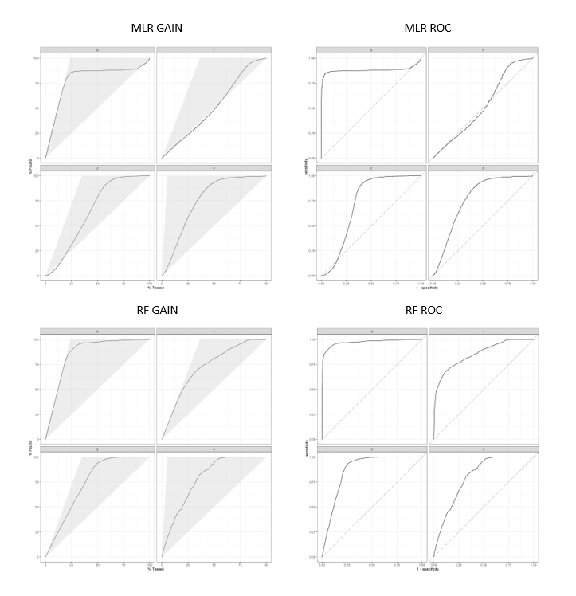

# Project 2

The goal of this project is to generate synthetic population data for East Mashonaland, Zimbabwe. The results of this project will be used with those of Project 1 to begin modeling agents' movement through the region using a gravity model in Project 3.

### Part One: Description of survey data

I downloaded individual and household data from Zimbabwe Standard DHS 2015. The data can be requested for download [here](https://dhsprogram.com/data/dataset/Zimbabwe_Standard-DHS_2015.cfm?flag=1). The final report for the survey can be viewed [here](https://dhsprogram.com/pubs/pdf/FR322/FR322.pdf). I used only the household data in my analysis, as I could expand it to individual-level data by rearranging how it recorded household members from columns to rows. I first explored the data in Stata to identify the variables which I would use in the study. The variables of interest are household ID (hhid), unit area (hv004), weights (hv005), location (hv024), household size (hv009), sex of household members (hv104_01 through hv104_27), age of household members (hv105_01 through hv105_27), education of household members (hv106_01 through hv106_27), and wealth (hv270) (though, wealth was not included in the formal analysis). I focused my analysis on the region of Mashonaland East, the ADM1 directly east of the capital, Harare. I also used population data from World Pop for Zimbabwe 2015, 100m resolution. The data can be downloaded [here](https://www.worldpop.org/geodata/summary?id=5209). The methods used in this paper are inspired by Frazier and Alfons ([2012](https://papers.ssrn.com/sol3/papers.cfm?abstract_id=2086345)). In the study of Mashonaland East, we end up with 373,402 households and 1,550,482 persons. These numbers are consistent with present population statistics and the average household size in the region (about 4 persons). A preview of the raw household data for Mashonaland East can be seen below.

Figure 1:

### Part Two: Description of spatially located households at the adm1 level

I subsetted household data from Mashonaland East from the national survey data. To estimate the actual number of households in Mashonaland East, I summed the population raster data from WorldPop and divided it by the mean household size from the DHS data. The distribution of household size for a random sample of 373,402 households with replacement can be seen in Figure 2 below. The sample from using country level survey data is in gold and Mashonaland East is in green. I then estimated the geographic locations of these households by distributing based on the population raster data for Mashonaland East using the rpoint() function. The weighted error from sampling with replacement from the original was 0.01%, so it is still pretty consistent.

Figure 2:

To evaluate my data, I used both multinomial logistic regression and random forest models (all with a 60-40 train-test split). I first applied a multinomial logistic regression using the nnet engine to the data to predict individuals' education level. This resulted in a low accuracy of 54.7%. So, I used a random forest with the ranger engine and achieved a much higher accuracy of 74.8%. See measures of accuracy below in Figure 3. I also trained a neural net using keras and achieved the highest accuracy of 75.4%. As can be seen in the matrix in Figure 4, it seems that the model had the most difficulty predicting whether an individual has pursued advanced education. To further improve the accuracy, I would include other variables such as wealth or religion to the model. These variables may have some explanatory power which is currently lacking.

Figure 3:

Figure 4:

### Part Three: Comparison to a randomly generated synthetic population

Based on the testing and modelling described above, the generated synthetic population does a better-than-random job of describing Mashonaland East at almost 75% accuracy. Spatially, by distributing the household locations along the population distribution, the data is much more accurate than a randomly distributed set of points. See Figure 5 below for a comparison.

Figure 5:

