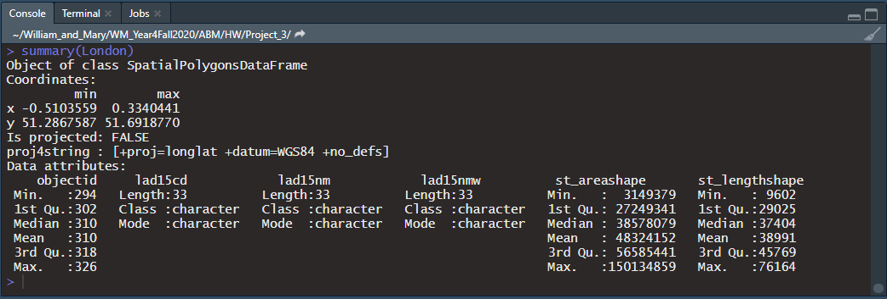
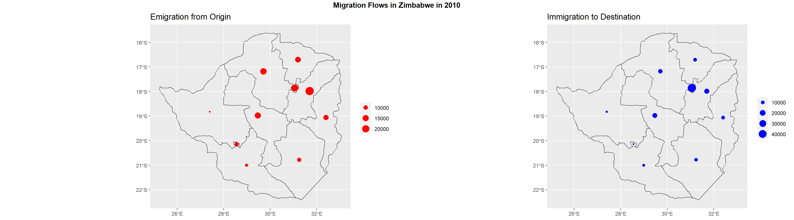
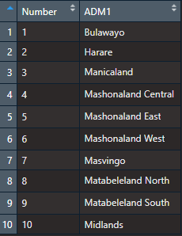
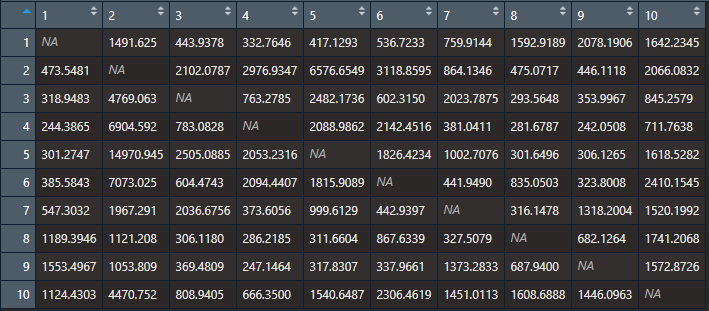
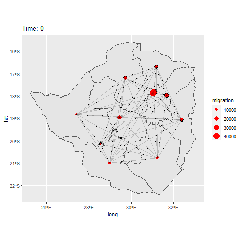
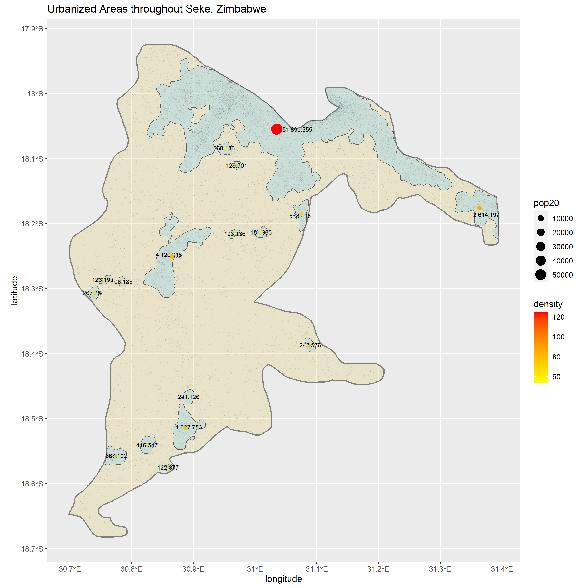
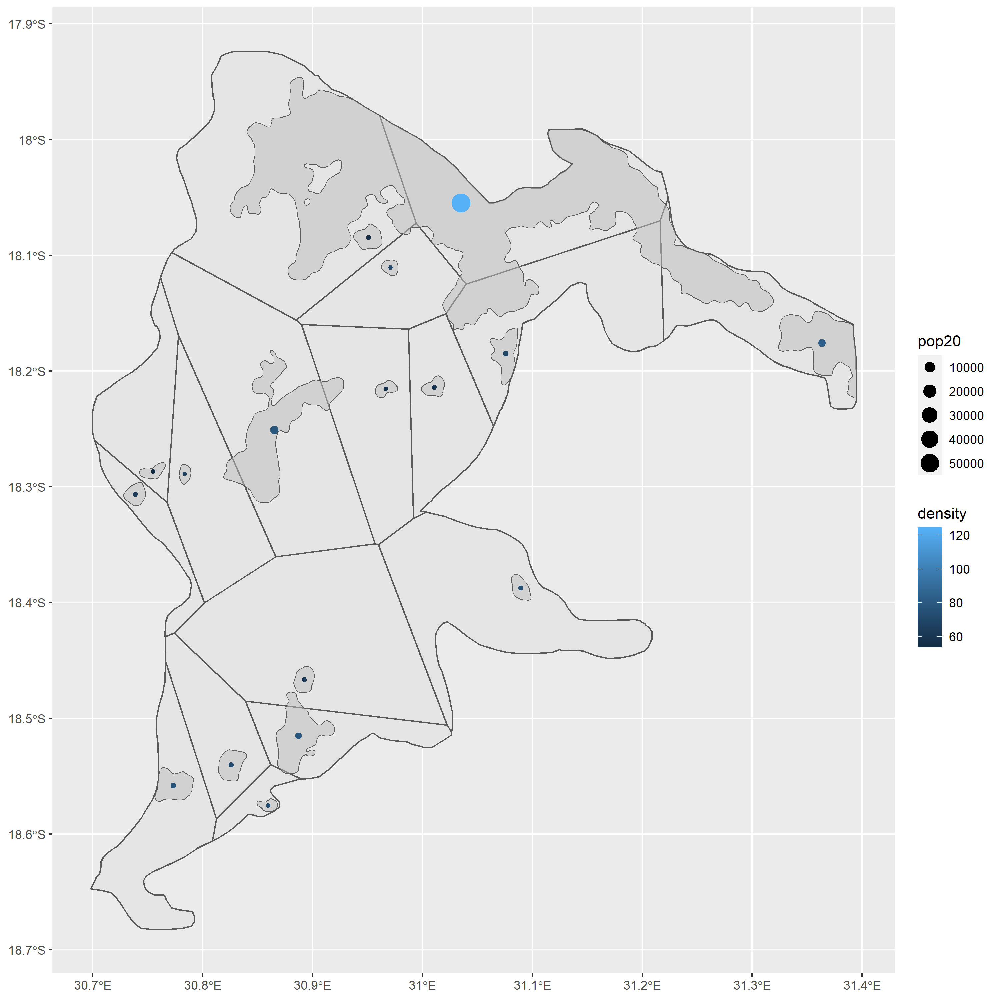

# Project 3

The goal of this project is to begin modeling human migration for Zimbabwe and the district of Seke.

### Part 1: London Gravity Model Example

Before modeling human migration / population flows in Zimbabwe, I practiced by following a [tutorial](https://rpubs.com/adam_dennett/257231) on creating a gravity model for London. First, I downloaded spatial data which described the administrative boundaries of England from the website and subsetted for the boroughs of London (district code includes E09), which can be seen in Figure 1. After projecting the spatial data and loading in variables for origin and destination flows across different types of connective infrastructure and transportation methods, I create a matrix and implement a gravity model.

Figure 1:
 

 

I then learned more about the applications of modeling movement by reading Garcia et al. 2015. Their article, "Modeling internal migration flows in sub-Saharan Africa using census microdata," also details how gravity models can both explain and predict migration. Globalization and the expansion of transportation networks transformed migration into a major poilcy issue. Modeling is a usefull tool for understanding and predicting flows where data are sparse, as well as strategic planning.

### Part 2: Visualization of Migration in Zimbabwe at ADM1 Level

With this knowledge in hand, I set out toward modeling internal migration in Zimbabwe. Using World Pop data from 2010 on migration flows at the provincial (ADM1) level, I first visualize inflows and outflows at the center point of each province. See Figure 2, where red points show outflows and blue points show inflows. 

Figure 2:
 

 

Then, I create a matrix of the origin and destination flows. Figure 3 presents a key for the province IDs in the data and Figure 4 presents the origin-destination matrix. Note that Zimbabwe has 10 provinces, so the matrix has 10 rows and 10 columns.

Figure 3:
 

 

Figure 4:
 

 

I expand this matrix to a 100 row x 2 column object, calculate the distances between the points, and digitize lines connecting all combinations of the points. Although it is not incorporated into our analysis in this project, the distance variable--as well as an additional variable which estimates aggregate or average nighttime lights radiance by province--could be integrated as specifications for a gravity model. For now, I simply use the origin-destination matrix's geometric combinations to visualize the flows between provinces. These flows can be observed in the Figure 5 animation, which shows one point per flow direction over one year (2010). With complete annual data, the number of points departing each origin could change over time by year. For example, the number or size of the points would increase over the course of the animation (1 second per year and it iterates through all years with a label clearly indicating which year is visualized at the moment). Incorporating a gravity model is one way we could visualize annual data after 2010 based on the distance between points, the nighttime lights radiance in each province, and other factors.

Figure 5:
 

 

### Part 3: Voronoi Polygons of Seke District

Finally, I import data from Project 1 on the de facto settlements and center points of Seke and data from Project 2 on the synthetically generated population of Mashonaland East. I intersect the synthetic population data with the boundary of Seke to subset the target population. Figure 6 overlays these data, with the tiny black dots representing the synthetic population.

Figure 6:
 

 

To apply the methods used in Parts 1 and 2 of this project, I create voronoi polygons for each of the centroids, clipped to the boundary of Seke (see Figure 7). These polygons act as the administrative boundaries from earlier parts of the project.

Figure 7:
 

 

In the future, I would produce variables to include in a gravity model for movement between these polygons. I would calculate the distance between these points as well as a metric (either sum or mean) for the radiance of nighttime lights within each of the polygons. Additional variables may include health infrastructure, roads, and elevation, as I did in Project 1. Then, based on the model output, I could produce a 17x17 matrix of flows between the settlements. This matrix could be elongated to a 289x2 object of point combinations. Then, I could reproduce the animation I did for Part 2 of this project now at the Seke district level. Again, instead of only producing data for one year, I could produce panel data (de facto voronoi polygon x year) which would enable me to modify my time variable or iterate the animation by year while changing the size of moving points to reflect the size of annual flows.
